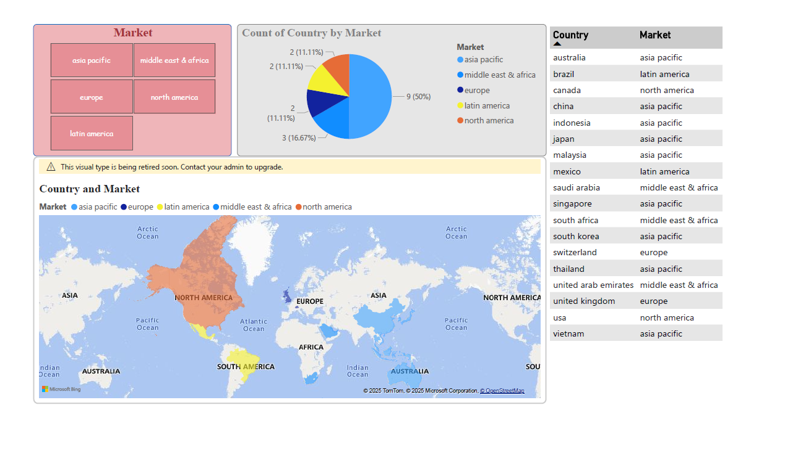

# Ghoti_Aquaculture
This project presents data visualization for the aquaculture sector using Power BI. It transforms raw aquacultural data into interactive dashboards, helping to analyze trends, track production, and gain insights for better decision-making in the field of aquaculture.

The data source is build by anonymous group assignment member.

Note: Kindly download the dashboard in .pbix for a better responsive illustration.

## Contents
### 1.0 Sales Information

### 2.0 Sales Performance

### 3.0 Market Information

### 4.0 Market Analysis

### 5.0 Customer Information

### 6.0 Customer Analysis

### 7.0 Product Performance

### 8.0 Stock Management

### 9.0  Discount Information

### 10.0 Discount Effectiveness

### 11.0 Shipping Efficency

